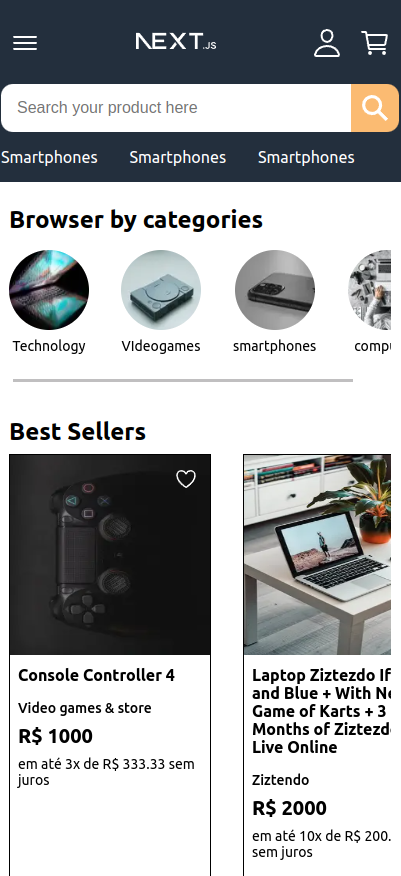

# Next - Commerce - Client - IN PROGRESS - UNTIL NOW MOBILE ONLY
Este projeto é apenas para proposítos de portfolio, tentando recriar um storefront de um e-commerce utilizando Next.js. Para falar a verdade não tenho a menor ideia de como quero seguir com o desenvolvimento desse projeto ou qualquer coisa relacionada a ele, estou apenas desenvolvendo nas horas vagas com a mentalidade de "fazer primeiro" e depois refatorar. Eu sei não é um grande negócio mas acredito que funcione nesse caso.

## Visão geral do projeto
O projeto conta com a ideia de ser um e-commerce quase completo que pelo menos passe a sensação de um. Por questões de tempo decidi utilizar o **STRAPI** para eu ter uma API REST customizada juntamente com um dashboard o mais rápido possível para eu ter mais tempo para mexer apenas com a parte do **CLIENT**.


## Objetivos do projeto
- Buscar uma nota alta em todas as páginas no lighthouse.
- Conforme a necessidade criar componentes ou funções que possam ser utéis para outros projetos.
- Tentar montar uma arquitetura de projeto simples e escalavel.
- Testar minha habilidade de desenvolvimento.
- implementar uma solução que se pareça muito com um E-commerce.
- Testar opções de otimização e performance.

## Estado atual do projeto
Em progresso, ainda falta algumas telas, componentes, integrações, popular o banco de dados, remover CSS desnecessário, corrigir algumas implementações no JS, adicionar persistência de dados e algumas funcionalidades, corrigir erros de projeto, transformar em typescript, adicionar versão de desktop. Novamente eu sei que não é o ideal deixar essas coisas para depois mas estou focando em deixar o projeto minimamente apresentável no momento.

## Técnologias ou práticas utilizadas e por que:

### i18n
Utilizado para "internacionalizar" nosso projeto, utilizando o padrão i18n conseguimos facilmente traduzir páginas para outros idiomas o que nós dias atuais é um implementação essencial, em alguns pontos eu particularmente sinto que até acabe facilitando manutenção ou desenvolvimento futuro.

### Server-Side Rendering
Bem, um dos motivos pela escolha do **Next.js** é a facilidade que ele trás em implemerntarmos um server-side do lado do cliente, que se torna extremamente útil para executarmos algumas funções fora do lado do front-end, além da fácil manunteção de rotas que ganhamos além de pordermos gerar páginas estáticas melhorando assim a perfomance em muitos casos.

### Next.js
Nunca havia usado Next.js antes, mas analisando essa ideia de projeto acabei achando ele ser a solução ideal para o projeto, ele trás várias soluções complexas de forma fácil. Além de ser focado em perfomance, ele te traz muitas coisas utéis como o Server-Side Renderindg, Rotas, Locales e fácil implementação de i8n, Image que melhora o carregamento de imagens entre outros beneficios, etc.

### React js
É uma poderosa biblioteca que facilita e muito o desenvolvimento de uma aplicação WEB te dando muitas opções de ferramentas que facilitam muito a sua vida na hora do desenvolvimento, facilitando a componentização, gerenciamento de ciclo de vida de componentes, gerenciamento de estado, hooks, facilidade de implementação de uma programação reativa.

### Redux
Um dos principais motivos por ter adicionado é por ele ser muiito utilizado no mercado mas além disso acredito que ele faça muito bem o trabalho de gerenciamento de fluxo de dados, e podermos implementar algo tipo FLUX sem muitos problemas com Redux.

### Flux Architecture
Embora eu ainda não considere que eu implementei 100%. Esta arquitetura acredito que seria ideal para este projeto por ela ser baseada em fluxo de dados o que acredito que este seja um cenário ideal para utilizarmos ela. Principalmente, por necessitarmos manter um controle de fluxo de dados do usuário enquanto ele navega pelo e-commerce, além de que se juntarmos fluxo de dados com uma programação reativa baseada nestes fluxos de dados + o gerenciamento de estado do React é quase que um combo perfeito para conseguirmos gerenciar facilmente nosso código enquanto desenvolvermos ou realizamos manutenção do projeto. Dando uma forte estrutura para nosso projeto.

### Components
Dividir para conquistar é a melhor forma que da para descrever componentes, quebrar seu código em pequenas partes funcionais e poder reaproveita-lo em diferentes partes do projeto é algo muito bem vindo na maioria das vezes.

### HTML, CSS, JS
Clássicos...De certa forma HTML e CSS no geral só aparecem na build mas as técnicas de desenvolvimento ainda estão vivas no desenvolvimento desse projeto. Javascript está sendo utilizado em boa parte do projeto ainda mas futuramente sera adaptado para typescripte e voltar aparecer somente nas builds.

### SCSS
Eu acredito que as facilidades geradas pelo nested e os mixins além de uma estrutura de código muito parecida com CSS faz SCSS ser um monstro para a estilização de páginas WEB.

### CSS/SCSS Modules
No geral é quase foi uma decisão mais particular do que qualquer outra coisa, mas a facilidade gerada pelo modules de podermos fazer um Modulo CSS para determinada página ou componente evitando que afete desnecessariamente outros componentes ou muito CSS desnecessário carregado. Faz com que muitas dores de cabeça sejam evitadas além de termos todos os beneficios do CSS/SCSS.

### BEM
Eu gosto de usar esse padrão de nome de classes para facilitar estilização global. Acredito que acerta de modo muito acertivo para nomes de classes até facilitando para o entendimento do que é aquele elemento HTML.

### REST
Extremamente utilizado em diversos projetos e é uma forma fácil de criar uma integração entre Client e API. Até considerei graphql para este projeto mas inicalmente quero testar algumas formas de implementação REST.

### Images  .webp
Estou convertendo imagens para webp para gerar um melhor beneficio na hora de carregamento e compatibilidade com navegadores.

### Lighthouse
É uma otima ferramenta para te dar uma luz em alguma implementação essencial que você deixou para trás ou algum possível problema sua paǵina está tendo. É uma boa metrica para analisar seu desenvolvimento ou procurar por alguma luz de algo que você precise melhorar em alguma página.

### Strapi
Inicialmente pensei nele apenas como apenas um facilitador, por ser muito fácil fazer uma API REST com ele sendo assim eu poderia focar mais tempo do lado do Client mas ao testar mais essa ferramenta percebi que pode ser realmente bastante utíl em projetos reais. Principalmente para criar algum conteúdo dinâmico tipo um "content-asset" onde um administrador pode cadastrar as informações no dashboard do STRAPI e puxarmos ela em algumas parte especifica do site. Realmente uma ótima ferramenta.


## Como instalar
Após clonar o projeto você precisa rodar o seguinte comando, isso instalara todas as dependencias node do projeto:
```
npm install
```
Após o npm instalado você ainda não pode iniciar o projeto. Antes disso vamos criar o ambiente do strapi. Para isso, crie outro projeto fora deste com o comando:
```
npx create-strapi-app@latest my-project --quickstart
```
Isso fara você criar um dashboard do strapi localmente em seu computador para mais informações: https://docs.strapi.io/dev-docs/quick-start.
<br>
Após ter criado seu projeto strapi e ter feito seu cadastro no admin local você precisa **importar** os dados desse projeto que pode ser encontrado na pasta **/strapi-imports** para isso use o seguinte comando:
```
npm run strapi import -- -f 24042023.tar.gz
```
para mais informações acesse: https://docs.strapi.io/dev-docs/data-management/import
<br>
Feito isso finalmente poderemos iniciar nosso ambiente de desenvolvimento com os seguintes comandos:
```
npm run dev // para este projeto next
npm run develop // para o dashboard do strapi
```

## Algumas imagens sobre o projeto
Quase todas as páginas possuem alguma interface exceto a página de pedidos.

### Homepage
As páginas que possuem caracteristicas parecidas com a homepage como página de vendedores e categorias, assim como a homepage recebem dados cadastrados pelo dashboard da strapi e após isso é renderizado a paǵina baseado no conteúdo cadastrado no Strapi.
<br>


<br>

### Carrinho
O carrinho é gerenciado atráves dos dados do redux, e quando você adiciona um item no carrinho é ativado o trigger de abrir o carrinho um custom event que realiza essa tarefa


<br>

## Imagens do site
Todas imagens utilizadas para produtos, cards, etc. Dentro do site foram retiradas do site PEXELS (https://www.pexels.com/pt-br/), um otimo site para se conseguir imagens para seus projetos.

## Curiosidades inutéis
A seguir algumas curiosidades totalmente desnecessárias.

### Validações de formulários
Por questões de preguiça para fazer uma validação especifica para cada formulário eu criei o seguinte wrapper **fieldFormAttributes**.
```html
 <input {...fieldFormAttributes({name: 'birthdate', rule: 'date--age', register, setErrors})}  className='form__input' type="date"/>
```
toda validação ocorre através da **rule** nesse caso da **rule: 'date--age'**, como funciona? No arquivo rules.js eu criei um conjunto de regras para validação de formulários que passara essas informações e sera executado juntamente com o **react-hook-forms** a seguir um exemplo da rule de date:
```js
{
    date: {
        regex:/^\d{4}[\/\-](0?[1-9]|1[012])[\/\-](0?[1-9]|[12][0-9]|3[01])$/,
        mask:[[/\D/g, ''],[/(\d{2})(\d)/, '$1/$2'],[/(\d{2})(\d)/, '$1/$2'],[/(\d{4})(\d)/, '$1']],
        validate: ['regex', 'validDate'],
        error: {
            regex: 'common.dateFormat',
            validDate: 'date.validDate'
        },
        modifier: {
            age: {
                validate: ['regex', 'validateAge'],
                params: {
                    validateAge: [18, 130]
                },
                error: {
                    regex: 'common.dateFormat',
                    validateAge: 'date.modifier.age.validateAge'
                }
            }
        }
    },
}
```
no caso a regra date--age é na verdade a regra de date que possui um modificador age, e essa regra com modificador é retratada como date--age. O modificador faz com que ele herde e sobrescreva algumas regras da regra original. Então quando formos validar o que sera validado sera a execução das funções registradas no campo validate, essas funções são executadas em ordem no array ou seja primeiro vai ser regex e depois validateAge, nisso podemos passar parametros para determinada função atráves de params onde está sendo passado os parametros 18, 130 para validateAge que seria equivalente a minAge = 18, maxAge = 130. E por fim passamos o erro respectivo para nossa função caso após ser executada a validação o campo seja invalido. Então passamos o respectivo caminho do i18n para cada função no validate.

# Default readme from next.js

This is a [Next.js](https://nextjs.org/) project bootstrapped with [`create-next-app`](https://github.com/vercel/next.js/tree/canary/packages/create-next-app).

## Getting Started

First, run the development server:

```bash
npm run dev
# or
yarn dev
# or
pnpm dev
```

Open [http://localhost:3000](http://localhost:3000) with your browser to see the result.

You can start editing the page by modifying `pages/index.tsx`. The page auto-updates as you edit the file.

[API routes](https://nextjs.org/docs/api-routes/introduction) can be accessed on [http://localhost:3000/api/hello](http://localhost:3000/api/hello). This endpoint can be edited in `pages/api/hello.ts`.

The `pages/api` directory is mapped to `/api/*`. Files in this directory are treated as [API routes](https://nextjs.org/docs/api-routes/introduction) instead of React pages.

This project uses [`next/font`](https://nextjs.org/docs/basic-features/font-optimization) to automatically optimize and load Inter, a custom Google Font.

## Learn More

To learn more about Next.js, take a look at the following resources:

- [Next.js Documentation](https://nextjs.org/docs) - learn about Next.js features and API.
- [Learn Next.js](https://nextjs.org/learn) - an interactive Next.js tutorial.

You can check out [the Next.js GitHub repository](https://github.com/vercel/next.js/) - your feedback and contributions are welcome!

## Deploy on Vercel

The easiest way to deploy your Next.js app is to use the [Vercel Platform](https://vercel.com/new?utm_medium=default-template&filter=next.js&utm_source=create-next-app&utm_campaign=create-next-app-readme) from the creators of Next.js.

Check out our [Next.js deployment documentation](https://nextjs.org/docs/deployment) for more details.
